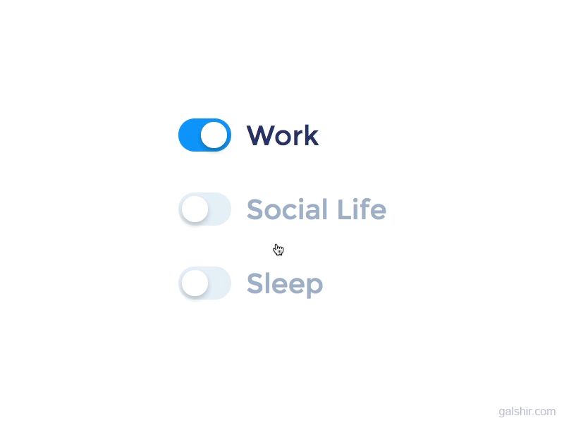

<h1 align="center">Hi , I'm Shivansh Kumar Jha</h1>

<h3 align="center">Crafting Frontend Intuition, 🧠 Orchestrating Backend Logic, and ⚙️ Mastering DSA</h3>

- 🔭 I’m currently working on the [cakeNbakes - Cakes World](https://github.com/ShivanshKumarJha/cakes-shopping) 🎂 with Admin Dashboard 🔗[live](https://cake-n-bakes-shopping.onrender.com/)
- ⚡ I’m looking to collaborate on [Maharaja - The Royal Resort](https://github.com/ShivanshKumarJha/maharaja-the-royal-resort) 🏨 with Admin Dashboard 🔗[live](https://maharaja-the-royal-resort.vercel.app/login)
- 🌱 I’m currently learning React.js and Next.js
- 👉 Know about me more [here](https://theshivanshfolio.netlify.app/)
- 💬 Ask me about musics 🎧 and movies 📽️

#### Connect with me:

#### Coding profiles:

#### Languages and tools:

  
 

  
   </a> 
 

 

  

### 📊 GitHub Stats:

  

  

  

